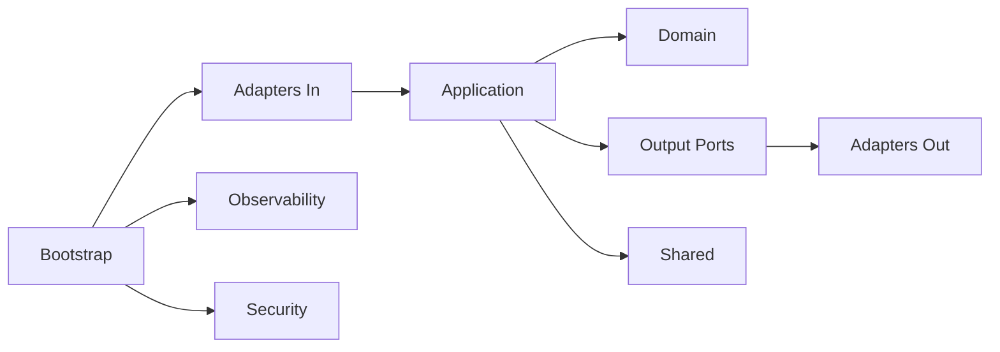

# Hex-arch-template

Template/playground de arquitetura hexagonal com foco em boundaries claros entre dominio, aplicacao e adapters.

## Indice completo do repositorio

- [`README.md`](README.md) - pagina central do repositorio
- [`AGENTS.md`](AGENTS.md) - diretrizes de implementacao e arquitetura
- [`build.gradle`](build.gradle) - build Gradle raiz
- [`settings.gradle`](settings.gradle) - registro dos subprojetos
- [`Taskfile.yml`](Taskfile.yml) - tarefas utilitarias
- [`makefile`](makefile) - atalhos locais
- [`docker/`](docker/) - stack local (observabilidade, localstack, mongo, message-manager)
- [`scripts/`](scripts/) - scripts utilitarios (`.sh` e `.bat`)
- [`runs/`](runs/) - configuracoes de execucao da IDE
- [`insomnia/`](api_collection/) - colecoes para testes de API
- [`modules/`](modules/) - modulos da aplicacao (detalhado abaixo)

## Indice completo de modulos



### `modules/adapters`

- `modules/adapters/in/api-rest` - adapter REST de entrada
- `modules/adapters/in/api-grpc` - adapter gRPC de entrada (ha scaffold/comentarios)
- `modules/adapters/in/queue-sqs` - adapter de entrada por fila SQS (scaffold)
- `modules/adapters/out/mongo` - adapter de persistencia Mongo
- `modules/adapters/out/cloud-aws` - adapter de saida AWS (scaffold)

### `modules/application`

- `modules/application/orderquestionnaire` - casos de uso e ports do contexto orderquestionnaire
- `modules/application/personmdm` - casos de uso do contexto personmdm

### `modules/domain`

- `modules/domain/orderquestionnaire` - regras de negocio e factories de orderquestionnaire
- `modules/domain/participantcatalog` - dominio de catalogo de participantes
- `modules/domain/personmdm` - dominio personmdm
- `modules/domain/productcatalog` - dominio de catalogo de produtos

### `modules/shared`

- [`modules/shared/README.md`](modules/shared/README.md) - documentacao central do modulo shared
- [`modules/shared/docs/`](modules/shared/docs/) - guias por funcionalidade

### Modulos transversais

- `modules/bootstrap` - app de bootstrap (`BootstrapApplication`)
- `modules/observability` - logging/aspectos de observabilidade
- `modules/security` - contratos e implementacoes de seguranca

## Atalhos de documentacao recomendados

- [`modules/shared/README.md`](modules/shared/README.md)
- [`modules/shared/docs/ResultPattern.md`](modules/shared/docs/ResultPattern.md)
- [`modules/shared/docs/RuleEngine.md`](modules/shared/docs/RuleEngine.md)
- [`modules/shared/docs/Stereotypes.md`](modules/shared/docs/Stereotypes.md)
- [`modules/shared/docs/TenantHeaders.md`](modules/shared/docs/TenantHeaders.md)

## Limitacoes atuais (estado do repositorio)

- Existem componentes scaffold/comentados em adapters de entrada/saida.
- `api-grpc` ainda possui partes comentadas e dependencias parciais.
- `queue-sqs` e `out/cloud-aws` estao com build/configuracao inicial.
- Parte da integracao de headers/tenant em REST/gRPC aparece como referencia comentada.

## Execucao rapida

No Windows PowerShell:

```powershell
.\gradlew.bat clean test
```

Para levantar stack local:

```powershell
docker compose -f docker/docker-compose.yml up -d
```
