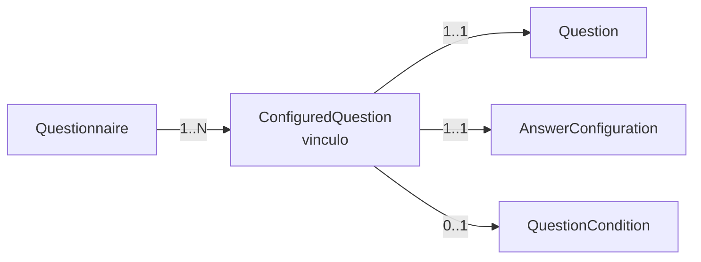
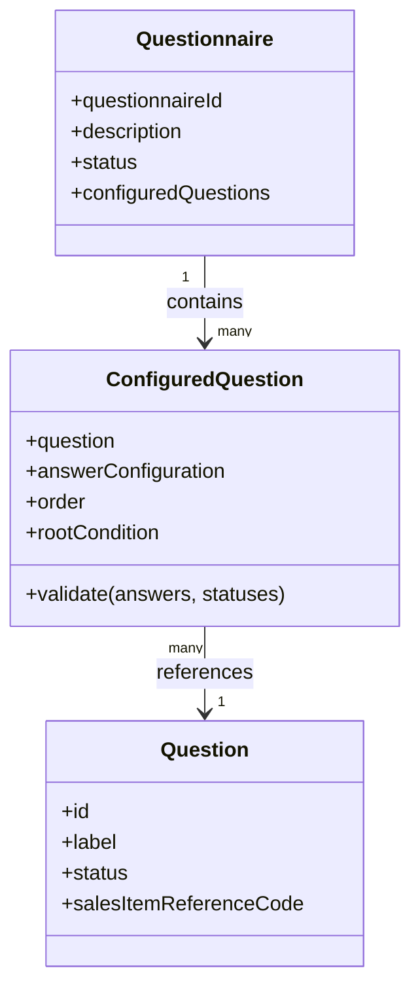
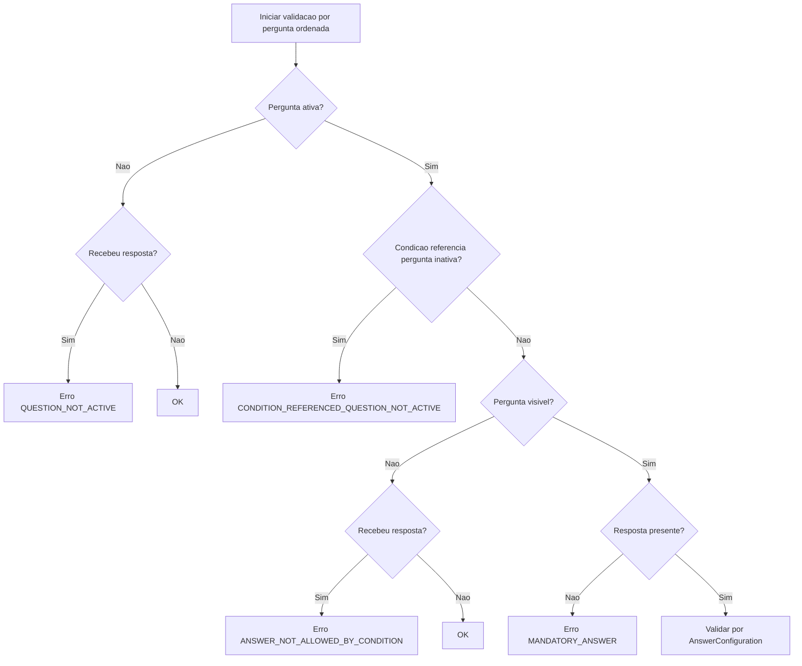
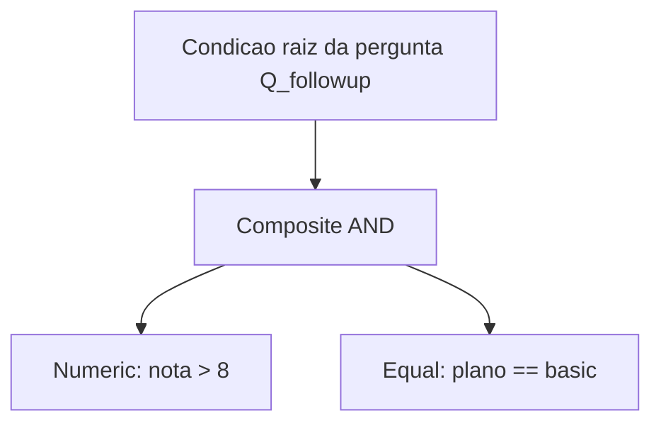
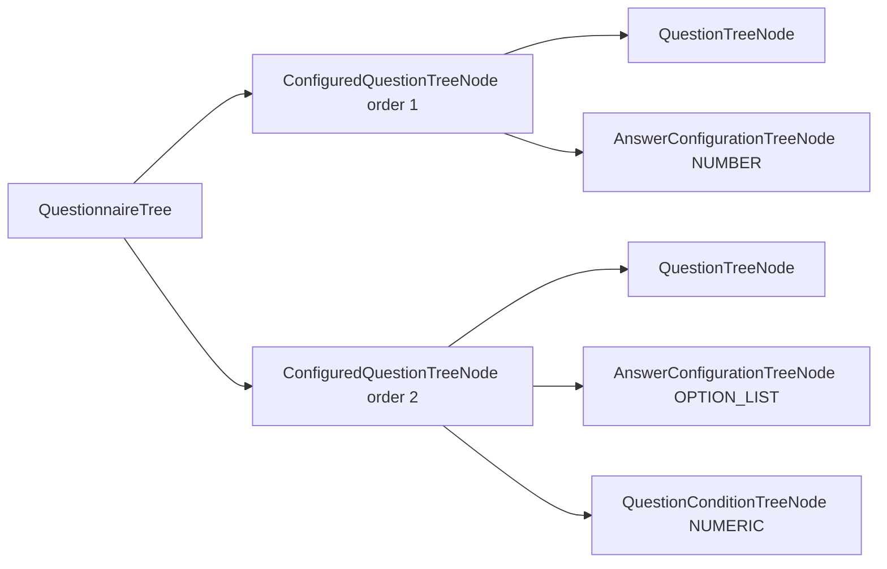

# Domain Module - OrderQuestionnaire

Este modulo concentra as regras de negocio puras para perguntas e questionarios.

## Para quem e este documento

- **Pessoa de negocio**: entender o que o questionario consegue modelar, quais regras sao aplicadas e como desenhar jornadas.
- **Pessoa de tecnologia**: entender os objetos de dominio, factories, validacoes e fluxo de execucao.

## Visao rapida do dominio



Leitura pratica:

- Um **Questionnaire** nao guarda apenas perguntas; ele guarda **vinculos configurados** (`ConfiguredQuestion`).
- Cada vinculo define:
  - qual pergunta entra,
  - qual tipo de resposta ela aceita,
  - em que ordem aparece,
  - e opcionalmente em qual condicao ela fica visivel.

---

## Modelo mental para negocio

Pense em 3 niveis:

1. **Catalogo de perguntas** (`Question`): "blocos reutilizaveis".
2. **Questionario** (`Questionnaire`): "produto final" para um canal e uma jornada.
3. **Vinculo configurado** (`ConfiguredQuestion`): "contrato de uso" da pergunta dentro daquele questionario.

Isso permite, por exemplo, usar a mesma pergunta em contextos diferentes, com comportamento diferente.

Exemplo de negocio:

- Pergunta base: `idade_cliente`
- No questionario de onboarding: aceitar somente `18..120`
- No questionario de auditoria interna: aceitar `0..120`

A pergunta e a mesma, mas o **vinculo** muda a configuracao de resposta.

---

## Modelo tecnico (objetos principais)

### 1) `Question`

Representa a pergunta reutilizavel.

Campos relevantes:

- `id`
- `label`
- `status` (`DRAFT`, `ACTIVE`, `INACTIVE`)
- `salesItemReferenceCode`
- `auditInfo`

Criacao via `QuestionFactory` (retorna `Result`).

### 2) `Questionnaire`

Representa o questionario para uma identidade composta:

- `id`
- `channelDistributionId`
- `journeyDistributionId`

Tambem tem:

- `description`
- `status`
- lista de `ConfiguredQuestion`
- `auditInfo`

Criacao via `QuestionnaireFactory` (retorna `Result`).

### 3) `ConfiguredQuestion` (o vinculo)

E a peca mais importante para comportamento.

Compoe:

- `question` (qual pergunta)
- `answerConfiguration` (como validar resposta)
- `order` (posicao)
- `rootCondition` (regra opcional de visibilidade)

---

## Possibilidades de relacao entre questionario e perguntas

## 1) Relacao principal: `Questionnaire` -> `ConfiguredQuestion` -> `Question`

- Um questionario possui **N vinculos configurados**.
- Cada vinculo aponta para **1 pergunta**.
- A mesma pergunta pode ser usada em **questionarios diferentes** com configuracoes diferentes.



## 2) Reuso da mesma pergunta com regras diferentes

Exemplo A (mesma pergunta, dois contextos):

- Questionario "app_venda": `renda_mensal` com `min=0`, `max=200000`
- Questionario "app_credito": `renda_mensal` com `min=1000`, `max=500000`

Exemplo B (mesma pergunta, UX diferente):

- No canal WEB aparece na ordem 2
- No canal APP aparece na ordem 5 e com condicao de visibilidade

## 3) Condicao por vinculo

A condicao nao fica na pergunta global; fica no vinculo.
Isso evita acoplamento global e permite jornadas diferentes.

---

## Tipos de configuracao por vinculo (`AnswerConfiguration`)

No builder de `ConfiguredQuestionFactory`, os tipos ativos hoje sao:

- `asText(...)`
- `asNumber(...)`
- `asDate(...)`
- `asOptionList(...)`

`AnswerType.OBJECT` existe no enum, mas nao ha estrategia de validacao dedicada neste modulo no momento.

### Tabela de configuracoes

| Configuracao | Quando usar (negocio) | Parametros principais | Exemplo |
|---|---|---|---|
| `asText` | texto livre, codigo, email, protocolo | `regexPattern`, `customErrorMessage` | CPF, e-mail, identificador |
| `asNumber` | nota, idade, valor monetario, quantidade | `min`, `max`, `step`, `allowedDecimal`, `allowedNegative`, `customErrorMessage` | NPS, idade, volume |
| `asDate` | data de agendamento, nascimento, vencimento | `maskFormat`, `allowPastDates`, `customErrorMessage` | data de visita |
| `asOptionList` | escolha controlada | `List<AnswerOptionItem>`, `customErrorMessage` | sim/nao, faixas, categorias |

### Exemplos diretos de configuracao

```java
// Texto com regex (ex.: protocolo ABC-1234)
ConfiguredQuestionFactory.from(question)
    .map(builder -> builder.withOrder(1)
        .asText(new ConfiguredQuestionFactory.TextConfig(
            "^[A-Z]{3}-\\d{4}$",
            "Use o formato ABC-1234"
        )));
```

```java
// Numero com faixa e passo (ex.: nota de 0 a 10, sem decimal)
ConfiguredQuestionFactory.from(question)
    .map(builder -> builder.withOrder(2)
        .asNumber(new ConfiguredQuestionFactory.NumberConfig(
            0.0, 10.0, 1.0, false, false,
            "Informe um numero inteiro entre 0 e 10"
        )));
```

```java
// Data sem passado (ex.: data da visita)
ConfiguredQuestionFactory.from(question)
    .map(builder -> builder.withOrder(3)
        .asDate(new ConfiguredQuestionFactory.DateConfig(
            "yyyy-MM-dd", false,
            "Escolha uma data futura"
        )));
```

```java
// Lista de opcoes (ex.: recomendaria?)
var options = List.of(
    AnswerOptionItem.createNew("yes", "Sim"),
    AnswerOptionItem.createNew("no", "Nao")
);

ConfiguredQuestionFactory.from(question)
    .map(builder -> builder.withOrder(4)
        .asOptionList(new ConfiguredQuestionFactory.ListConfig(
            options,
            "Escolha uma opcao valida"
        )));
```

---

## Tipos de resposta e comportamento de validacao

## Regras gerais (independente do tipo)

Durante `Questionnaire.answerValidation(answers)`:

1. Se a pergunta estiver `INACTIVE`/nao ativa:
   - se veio resposta para ela -> falha (`QUESTION_NOT_ACTIVE`)
   - se nao veio -> ok
2. Se condicao referencia pergunta inativa -> falha (`CONDITION_REFERENCED_QUESTION_NOT_ACTIVE`)
3. Se pergunta nao esta visivel pela condicao:
   - se veio resposta -> falha (`ANSWER_NOT_ALLOWED_BY_CONDITION`)
   - se nao veio -> ok
4. Se visivel e sem resposta -> falha (`MANDATORY_ANSWER`)
5. Se visivel e com resposta -> aplica a estrategia (`TEXT`, `NUMBER`, `DATE`, `OPTION_LIST`)



## Regras por tipo

### `TEXT`

- Resposta deve ser `String`
- Se `regexPattern` existe, precisa casar

Exemplos:

- Pedido de email: regex simples
- Codigo de cupom: `^[A-Z0-9]{8}$`
- Placa customizada: formato especifico da area

### `NUMBER`

- Resposta deve ser numerica
- Valida decimal permitido, negativo permitido, minimo, maximo e passo

Exemplos:

- Idade: `min=0`, `max=120`, `allowedDecimal=false`
- Nota NPS: `min=0`, `max=10`, `step=1`
- Peso em kg: `min=0`, `max=500`, `allowedDecimal=true`

### `DATE`

- Resposta deve ser `LocalDate`
- Se `allowPastDates=false`, datas passadas falham

Exemplos:

- Data de agendamento (somente futuro)
- Data de nascimento (aceita passado)

### `OPTION_LIST`

- Resposta deve ser `String`
- Valor precisa existir na lista de opcoes configuradas

Exemplos:

- `yes/no`
- `basic/standard/premium`
- `muito_satisfeito/satisfeito/neutro/insatisfeito`

---

## Condicoes entre perguntas (`QuestionCondition`)

Tipos disponiveis hoje:

- `EqualCondition`
- `NumericCondition`
- `VisibilityCondition`
- `CompositeCondition` (AND/OR)

Composicao facilitada por:

- `QuestionConditionComposer`
- `CompositeConditionBuilder`

### 1) `EqualCondition`

Regra: a resposta da pergunta raiz deve ser igual ao valor esperado.

Exemplos:

- Mostrar pergunta de detalhe quando `tipo_cliente == "empresa"`
- Mostrar pergunta de cancelamento quando `deseja_cancelar == true`

### 2) `NumericCondition`

Regra numerica com operador:

- `>`
- `>=`
- `<`
- `<=`
- `==`
- `!=`

Exemplos:

- Mostrar follow-up quando `nota_atendimento > 7`
- Mostrar oferta premium quando `renda >= 8000`

### 3) `VisibilityCondition`

Compara valor esperado com a resposta da pergunta raiz (sem operador numerico explicito).

Exemplos:

- Mostrar bloco B quando `aceita_contato == true`
- Mostrar pergunta de filial quando `pais == "BR"`

### 4) `CompositeCondition` (AND/OR)

Permite combinar multiplas regras.

Exemplo AND:

- exibir pergunta de upsell somente se:
  - `nota > 8`
  - e `produto_atual == "basic"`

Exemplo OR:

- exibir pergunta de risco se:
  - `idade < 18`
  - ou `renda < 1500`



### Exemplo de composicao fluente

```java
QuestionCondition condition = QuestionConditionComposer
    .condition(new NumericCondition("q_nota", 8, ">"))
    .and(new EqualCondition("q_plano", "basic"))
    .build();
```

---

## Exemplos completos (tecnico + negocio)

## Exemplo 1 - Pesquisa simples de satisfacao

Objetivo de negocio:

- medir satisfacao
- perguntar recomendacao apenas para notas altas

Modelagem:

- `q_nota` -> `NUMBER (0..10)`
- `q_recomendaria` -> `OPTION_LIST(yes/no)`, visivel se `q_nota > 7`

Comportamentos esperados:

- nota 8 e resposta yes -> sucesso
- nota 5 sem resposta de recomendacao -> sucesso (pergunta oculta)
- nota 8 sem resposta de recomendacao -> falha obrigatoria

(este fluxo esta refletido no BDD `answer-validation.feature`)

## Exemplo 2 - Cadastro com segmento de cliente

- `q_tipo_cliente` (`OPTION_LIST`: pessoa_fisica, empresa)
- `q_cnpj` (`TEXT` regex CNPJ), condicao: `q_tipo_cliente == "empresa"`
- `q_cpf` (`TEXT` regex CPF), condicao: `q_tipo_cliente == "pessoa_fisica"`

Ganhos de negocio:

- coleta apenas dados relevantes
- reduz friccao

## Exemplo 3 - Elegibilidade de credito

- `q_renda` (`NUMBER`, min 0)
- `q_score` (`NUMBER`, 0..1000)
- `q_oferta_premium` (`OPTION_LIST`), condicao composta:
  - `q_renda >= 8000` AND `q_score >= 700`

## Exemplo 4 - Agendamento

- `q_data_visita` (`DATE`, `allowPastDates=false`)
- `q_periodo` (`OPTION_LIST`: manha, tarde, noite)

Regras:

- data passada -> falha
- data futura + periodo valido -> sucesso

## Exemplo 5 - Cross-sell com OR

- `q_categoria` (`OPTION_LIST`: tv, internet, telefone)
- `q_gasto_mensal` (`NUMBER`)
- `q_oferta_combo` visivel se:
  - `q_categoria == "tv"` OR `q_gasto_mensal > 250`

## Exemplo 6 - Controle por status da pergunta

- Pergunta `q_legado` esta `INACTIVE`
- Se payload tentar responder `q_legado` -> falha `QUESTION_NOT_ACTIVE`
- Se nao responder -> ignorada sem bloquear validacao

---

## Exemplo visual da arvore exportavel

`Questionnaire.toTree()` gera uma representacao estruturada para leitura/inspecao.



---

## Como a camada application consome este dominio

Fluxo tipico de validacao de respostas:

1. application recebe um comando (ex.: `ValidateQuestionnaireAnswersCommand`)
2. application recupera o `Questionnaire` com perguntas configuradas
3. application chama `questionnaire.answerValidation(answers)`
4. retorna sucesso ou lista de `QuestionValidationFailure`

Exemplo simplificado:

```java
Result<Void, List<QuestionValidationFailure>> result = questionnaire.answerValidation(command.answers());
```

Isso mantem o contrato de negocio dentro do dominio e evita espalhar validacoes por adapters.

---

## Referencias rapidas no codigo

- Questionarios: `questionnaire/Questionnaire.java`, `questionnaire/QuestionnaireFactory.java`
- Vinculos: `questionnaire/ConfiguredQuestion.java`, `questionnaire/ConfiguredQuestionFactory.java`
- Estrategias de resposta: `questionnaire/answer/strategy/*`
- Condicoes: `questionnaire/conditioner/*`
- BDD: `src/test/resources/features/orderquestionnaire/answer-validation.feature`

---

## Resumo executivo

Para negocio:

- voce monta jornadas dinamicas com perguntas condicionais,
- controla obrigatoriedade e formato por contexto,
- e reduz erros de preenchimento com regras explicitas.

Para tecnologia:

- o dominio usa factories + `Result` para validacao previsivel,
- modela variacao por estrategia de resposta,
- e aplica condicoes compostas de forma declarativa e testavel.


