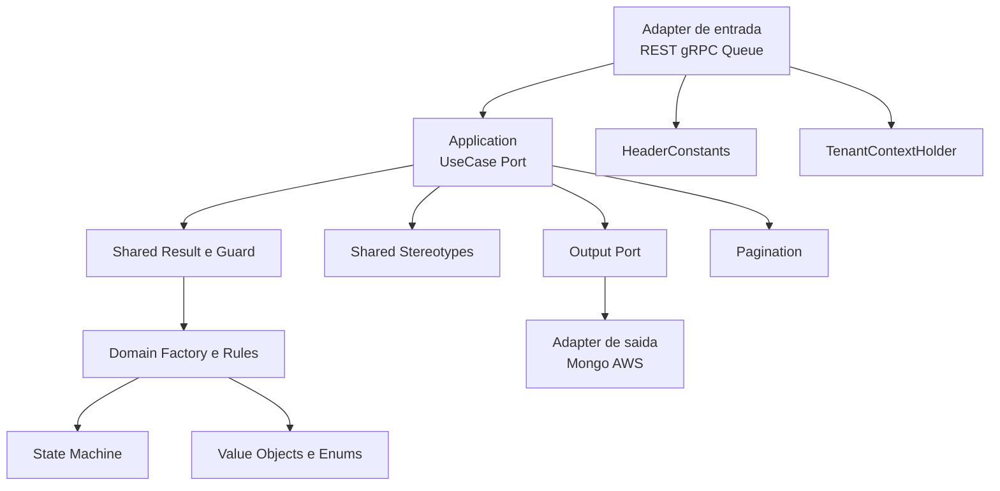

# Shared Module

Este modulo concentra contratos e utilitarios reutilizaveis em toda a arquitetura hexagonal.
A ideia principal e manter regras transversais em um lugar unico, com baixo acoplamento.

Se voce nunca usou este modulo: comece pela trilha de leitura em `Guia de inicio rapido`.

## O que voce encontra no shared

- Fluxo funcional de sucesso/erro com `Result<V, E>` e `DomainError`
- Validacao declarativa com `Guard` e `DomainRuleRunner`
- Rule engine simples (`Rule`, `GenericRule`, `RuleValidator`, `FailNotification`)
- Estereotipos arquiteturais (`@UseCase`, `@InputPort`, `@OutputPort`, etc.)
- Contratos de paginacao hibrida (page/cursor)
- Maquina de estados generica com guardas e acoes
- **Pipeline engine** com compensacao LIFO e rollback ambidestro (`Step`, `PipelineContext`, `PipelineOrchestrator`, `RollbackStyle`)
- Contexto de tenant por thread (`TenantContextHolder`)
- Constantes de headers (`HeaderConstants`)
- Value objects e enums compartilhados (`Id`, `AuditInfo`, `ParameterizationStatus`, etc.)

## Visao geral do modulo



## Guia de inicio rapido

Checklist para comecar sem se perder:

1. Entenda como representar erro de negocio sem exception: [`docs/ResultPattern.md`](docs/ResultPattern.md)
2. Aprenda validacao acumulada e fail-fast: [`docs/RuleEngine.md`](docs/RuleEngine.md)
3. Veja como marcar fronteiras hexagonais: [`docs/Stereotypes.md`](docs/Stereotypes.md)
4. Depois avance para contratos de runtime: tenant/headers, paginacao e state machine

## Trilha de leitura em 30 minutos (guia dedicado)

Objetivo: sair com visao pratica do shared e conseguir aplicar o padrao em uma feature nova.

- `0-5 min`: leia visao geral deste README e o mapa de docs.
- `5-12 min`: leia [`docs/ResultPattern.md`](docs/ResultPattern.md) para entender `Result`, `Guard` e `DomainRuleRunner`.
- `12-17 min`: leia [`docs/RuleEngine.md`](docs/RuleEngine.md) para regras compostas e acumulacao de falhas.
- `17-21 min`: leia [`docs/Stereotypes.md`](docs/Stereotypes.md) para alinhar naming e fronteiras hexagonais.
- `21-26 min`: leia [`docs/TenantHeaders.md`](docs/TenantHeaders.md) para contexto de tenant e padronizacao de headers.
- `26-30 min`: leia [`docs/Pagination.md`](docs/Pagination.md), [`docs/StateMachine.md`](docs/StateMachine.md) e [`docs/ValueObjectsEnums.md`](docs/ValueObjectsEnums.md) para contratos de suporte.

Ao final da trilha, abra exemplos reais em:

- `modules/application/orderquestionnaire/src/main/java/com/acme/orderquestionnaire/application/questionnaire/service/CreateQuestionnaireService.java`
- `modules/domain/orderquestionnaire/src/main/java/com/acme/orderquestionnaire/domain/questionnaire/QuestionnaireFactory.java`

## Mapa da documentacao (docs)

- [`docs/ResultPattern.md`](docs/ResultPattern.md) - `Result`, `DomainError`, `ErrorCatalog`, `Guard`, `DomainRuleRunner`
- [`docs/RuleEngine.md`](docs/RuleEngine.md) - Engine de regras com `Specification + Notification`
- [`docs/Stereotypes.md`](docs/Stereotypes.md) - Anotacoes arquiteturais e de testes
- [`docs/TenantHeaders.md`](docs/TenantHeaders.md) - `TenantContextHolder` e `HeaderConstants`
- [`docs/Pagination.md`](docs/Pagination.md) - `HybridPageRequest`, `PageResult`, `SortSpec`
- [`docs/StateMachine.md`](docs/StateMachine.md) - `StateMachineConfig`, `TransitionAction`, `TransitionResult`
- [`docs/Pipeline.md`](docs/Pipeline.md) - `Step`, `PipelineContext`, `PipelineOrchestrator`, `RollbackStyle`, `PipelineFailureException`
- [`docs/ValueObjectsEnums.md`](docs/ValueObjectsEnums.md) - `Id`, `User`, `AuditInfo`, `ParameterizationStatus`, `PortType`

## Onde isso aparece no projeto

Exemplos reais para consulta:

- Uso forte de `Result` + `Guard` na aplicacao:
  - `modules/application/orderquestionnaire/src/main/java/com/acme/orderquestionnaire/application/questionnaire/service/CreateQuestionnaireService.java`
  - `modules/application/orderquestionnaire/src/main/java/com/acme/orderquestionnaire/application/question/service/CreateQuestionService.java`
- Validacao de dominio com `DomainRuleRunner`:
  - `modules/domain/orderquestionnaire/src/main/java/com/acme/orderquestionnaire/domain/questionnaire/QuestionnaireFactory.java`
  - `modules/domain/orderquestionnaire/src/main/java/com/acme/orderquestionnaire/domain/question/QuestionFactory.java`
- Maquina de estados do dominio:
  - `modules/domain/orderquestionnaire/src/main/java/com/acme/orderquestionnaire/domain/questionnaire/QuestionnaireStatusMachine.java`
  - `modules/domain/orderquestionnaire/src/main/java/com/acme/orderquestionnaire/domain/question/QuestionStatusMachine.java`

## Quando usar e quando nao usar

- Use `Result` para erros esperados de negocio (validacao, regra, pre-condicao)
- Use exceptions para falhas tecnicas inesperadas (infra, bug, indisponibilidade)
- Use `Guard.collect` para validacoes independentes e acumuladas
- Use `DomainRuleRunner` para regras declarativas de dominio reaproveitaveis
- Use `TenantContextHolder` somente em bordas de requisicao e sempre limpe no final

## Limitacoes atuais

- Alguns componentes de adapters continuam scaffold/comentados e servem como referencia.
- Referencias de headers/tenant em REST/gRPC estao presentes, mas nem todas estao ativas.
- Integracoes AWS/SQS no repositorio ainda aparecem com implementacao parcial em alguns modulos.
- Antes de acoplar comportamento novo, confirme se o adapter alvo esta ativo no build atual.

## Testes do modulo

Para executar os testes do modulo shared no Windows PowerShell:

```powershell
.\gradlew.bat :modules:shared:test
```

## Dica de onboarding

Se voce estiver implementando uma feature nova:

1. Comece pelo dominio com `Result` + regras.
2. Orquestre no application via ports e use cases.
3. Traduza para protocolo (REST/gRPC/queue) apenas nos adapters.
4. Reaproveite contratos do shared em vez de criar utilitarios locais.
