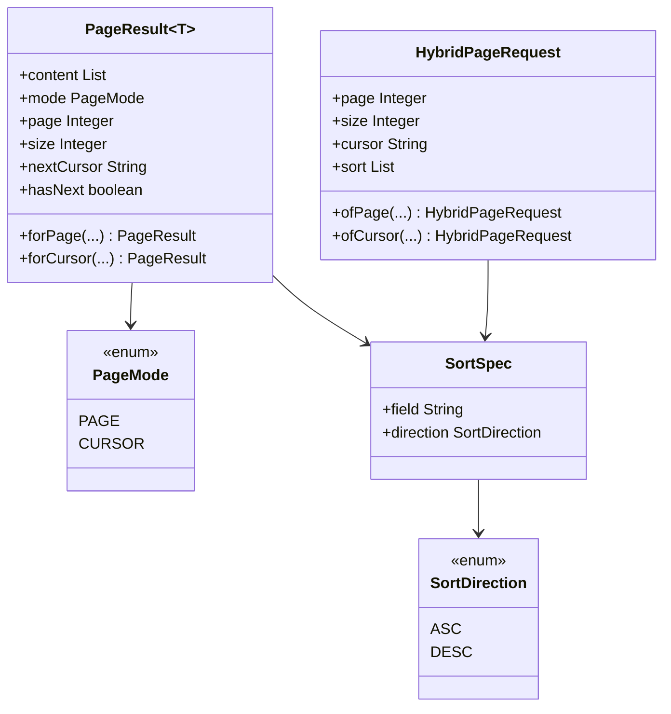
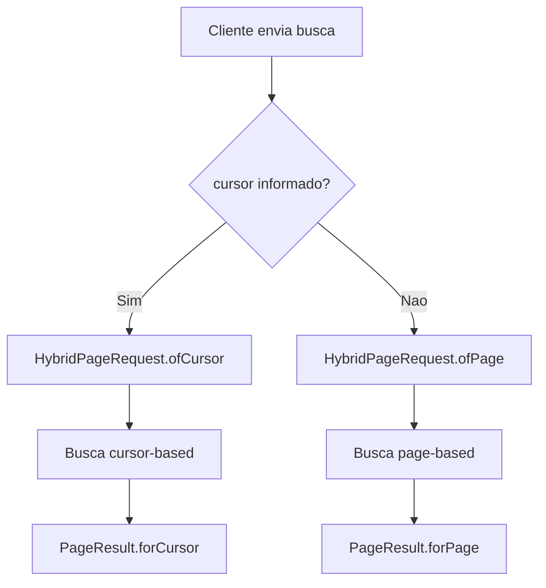
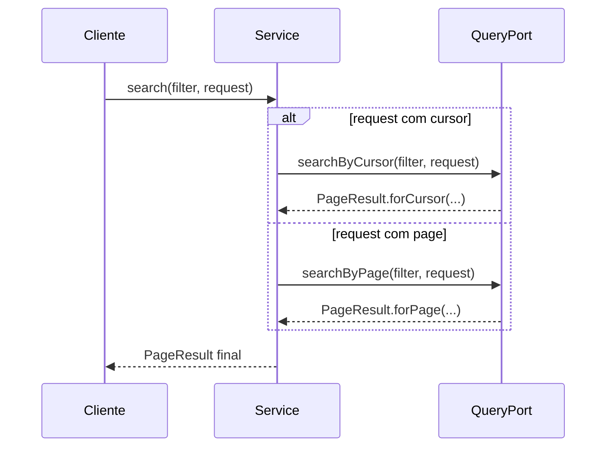

# Paginacao hibrida (page e cursor)

O shared fornece contratos de paginacao para voce usar sem depender de framework especifico.

Navegacao: [README central](../README.md) | [State Machine](StateMachine.md) | [Value Objects e Enums](ValueObjectsEnums.md)

## 1) Classes principais

- `HybridPageRequest` -> entrada de busca (`page/size` ou `cursor/size`)
- `PageResult<T>` -> saida da busca
- `PageMode` -> `PAGE` ou `CURSOR`
- `SortSpec` -> campo + direcao de ordenacao
- `SortDirection` -> `ASC` ou `DESC`





## 2) Entrada: `HybridPageRequest`

Voce tem dois modos:

- Modo pagina: `ofPage(page, size, sort)`
- Modo cursor: `ofCursor(cursor, size, sort)`

Exemplo:

```java
import com.acme.shared.pagination.HybridPageRequest;
import com.acme.shared.pagination.SortDirection;
import com.acme.shared.pagination.SortSpec;

import java.util.List;

HybridPageRequest pageRequest = HybridPageRequest.ofPage(
        0,
        20,
        List.of(new SortSpec("createdAt", SortDirection.DESC))
);

HybridPageRequest cursorRequest = HybridPageRequest.ofCursor(
        "cursor-abc",
        20,
        List.of(new SortSpec("id", SortDirection.ASC))
);
```

Regras de validacao embutidas:

- `size` deve ser maior que zero
- se `cursor` estiver preenchido, `page` deve ser `null`
- sem `cursor`, `page` deve ser `>= 0`

## 3) Saida: `PageResult<T>`

### Modo pagina

```java
import com.acme.shared.pagination.PageResult;

PageResult<String> result = PageResult.forPage(
        List.of("a", "b"),
        0,
        20,
        120,
        6,
        true,
        false,
        List.of(new SortSpec("createdAt", SortDirection.DESC))
);
```

### Modo cursor

```java
import com.acme.shared.pagination.PageResult;

PageResult<String> result = PageResult.forCursor(
        List.of("a", "b"),
        20,
        "cursor-next-xyz",
        true,
        List.of(new SortSpec("id", SortDirection.ASC))
);
```

## 4) Exemplo de uso em service

```java
public PageResult<QuestionnaireView> searchByFilter(QuestionnaireFilter filter, HybridPageRequest request) {
    if (request.cursor() != null && !request.cursor().isBlank()) {
        return queryPort.searchByCursor(filter, request);
    }
    return queryPort.searchByPage(filter, request);
}
```



## 5) Onde aparece no projeto

- `modules/shared/src/test/java/com/acme/shared/pagination/PaginationContractsTest.java`
- `modules/application/orderquestionnaire/src/test/java/com/acme/orderquestionnaire/application/questionnaire/view/QuestionnaireViewTest.java`
- `modules/application/orderquestionnaire/src/test/java/com/acme/orderquestionnaire/application/FunctionalTest.java`

## 6) Boas praticas para iniciantes

- Defina ordenacao padrao quando cliente nao informar
- Em cursor mode, use cursor opaco (nao exponha detalhes internos)
- Evite `size` muito alto para proteger latencia
- Retorne `appliedSort` no resultado para observabilidade

Voltar: [README central do shared](../README.md)

