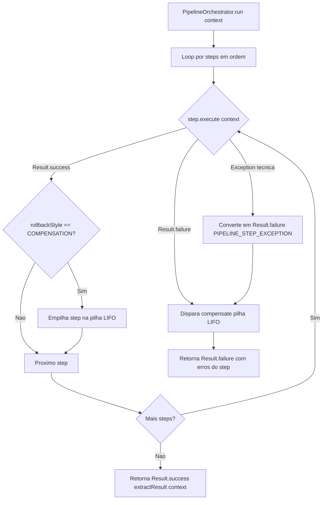

# Pipeline Engine

O shared oferece um motor de execucao de pipelines (esteiras) tipado, com suporte a short-circuit, rollback por compensacao (Saga) e rollback gerenciado por framework (transacional).

Navegacao: [README central](../README.md) | [Result Pattern](ResultPattern.md) | [State Machine](StateMachine.md)

---

## 1) Componentes

| Classe/Interface | Pacote | Responsabilidade |
|---|---|---|
| `Step<C>` | `shared/engine/pipeline` | Unidade de trabalho independente |
| `RollbackStyle` | `shared/engine/pipeline` | Modo de desfazimento: NONE, COMPENSATION, FRAMEWORK_TRANSACTION |
| `PipelineContext` | `shared/engine/pipeline` | Data Bag type-safe compartilhado entre steps |
| `PipelineOrchestrator<C,V>` | `shared/engine/pipeline` | Motor generico: executa steps, faz short-circuit, compensa |
| `PipelineFailureException` | `shared/exception` | Carrega `List<DomainError>` para acionar rollback transacional |

---

## 2) Modelo de execucao



---

## 3) RollbackStyle — opcoes

### NONE (padrao)
Steps sem efeito colateral relevante: validacoes, pre-condicoes, checks de existencia.
O orquestrador nao chama `rollback()` nestes steps.

### COMPENSATION
O step realizou uma operacao que precisa ser desfeita pela aplicacao.  
Exemplos: publicou evento em fila SQS/SNS, chamou API externa, gravou em banco fora da transacao principal.

O orquestrador empilha o step e chama `rollback(context)` em LIFO caso um step posterior falhe.

### FRAMEWORK_TRANSACTION
O rollback e responsabilidade do framework (ex: Spring `@Transactional`).  
O orquestrador **nao** chama `rollback()` neste step.  
A borda transacional converte `Result.failure` em `PipelineFailureException` para o framework reagir.

---

## 4) Modo hibrido

Uma pipeline pode misturar os tres estilos:

```
[ValidateCommand]       NONE
[BuildAudit]            NONE
[CheckChannel]          NONE
[PersistQuestionnaire]  FRAMEWORK_TRANSACTION  ← BD reverte via @Transactional
[PublishEvent]          COMPENSATION           ← aplicacao reverte via rollback()
```

Se `PublishEvent` falha, o orquestrador:
1. chama `PublishEvent.rollback()` — compensa a publicacao
2. nao chama `PersistQuestionnaire.rollback()` — BD sera revertido pelo framework
3. retorna `Result.failure(errors)` ao chamador

O `@Transactional` na borda recebe `PipelineFailureException` e desfaz a transacao do banco.

---

## 5) Como usar — passo a passo

### Passo 1: Criar o contexto do caso de uso

```java
// extends PipelineContext — expoe API fluente em vez de Map raw
public class CreateQuestionnairePipelineContext extends PipelineContext {

    private final CreateQuestionnaireCommand command;

    public CreateQuestionnairePipelineContext(CreateQuestionnaireCommand command) {
        this.command = command;
    }

    public CreateQuestionnaireCommand command() { return command; }

    public void auditInfo(AuditInfo info)  { put(AuditInfo.class, info); }
    public AuditInfo auditInfo()           { return get(AuditInfo.class); }

    public void createdView(QuestionnaireCreatedView v) { put(QuestionnaireCreatedView.class, v); }
    public QuestionnaireCreatedView createdView()       { return get(QuestionnaireCreatedView.class); }
}
```

### Passo 2: Implementar cada Step

```java
public class ValidateCommandStep implements Step<CreateQuestionnairePipelineContext> {

    @Override
    public String id() { return "VALIDATE_COMMAND"; }

    // rollbackStyle() default = NONE — nao precisa override

    @Override
    public Result<Void, List<DomainError>> execute(CreateQuestionnairePipelineContext ctx) {
        if (ctx.command() == null) {
            return QuestionnaireErrors.INVALID_COMMAND.asFailure();
        }
        return Guard.collect(List.of(
            QuestionnaireFactory.validateCreatePayload(...)
        ));
    }
}
```

Step com compensacao:
```java
public class PersistQuestionnaireStep implements Step<CreateQuestionnairePipelineContext> {

    @Override public String id() { return "PERSIST_QUESTIONNAIRE"; }

    @Override public RollbackStyle rollbackStyle() { return RollbackStyle.COMPENSATION; }

    @Override
    public Result<Void, List<DomainError>> execute(CreateQuestionnairePipelineContext ctx) {
        return repository.create(ctx.questionnaire()).map(saved -> {
            ctx.put(Questionnaire.class, saved);
            return (Void) null;
        });
    }

    @Override
    public void rollback(CreateQuestionnairePipelineContext ctx) {
        if (ctx.has(Questionnaire.class)) {
            repository.deleteById(ctx.get(Questionnaire.class).id());
        }
    }
}
```

### Passo 3: Criar o servico orquestrador

```java
public class CreateQuestionnaireService
        extends PipelineOrchestrator<CreateQuestionnairePipelineContext, QuestionnaireCreatedView>
        implements CreateQuestionnaireUseCase {

    public CreateQuestionnaireService(List<Step<CreateQuestionnairePipelineContext>> steps) {
        super(steps);    // lista ja ordenada e filtrada pelo bootstrap
    }

    @Override
    public Result<QuestionnaireCreatedView, List<DomainError>> execute(CreateQuestionnaireCommand command) {
        return run(new CreateQuestionnairePipelineContext(command));
    }

    @Override
    protected QuestionnaireCreatedView extractResult(CreateQuestionnairePipelineContext ctx) {
        return ctx.createdView();   // le o resultado construido pelos steps
    }
}
```

### Passo 4: Montar a pipeline no bootstrap

```java
@Configuration
@EnableConfigurationProperties(QuestionnairePipelineProperties.class)
class CreateQuestionnaireUseCaseConfig {

    @Bean
    CreateQuestionnaireUseCase createQuestionnaireUseCase(
            QuestionnairePipelineProperties props, ...) {

        // steps registrados (ordem declarativa no Map)
        Map<String, Step<CreateQuestionnairePipelineContext>> registry = Map.of(
            "VALIDATE_COMMAND",            new ValidateCommandStep(),
            "BUILD_AUDIT",                 new BuildAuditStep(),
            "CHECK_CHANNEL_DISTRIBUTION",  new CheckChannelDistributionStep(channelPort),
            "CHECK_NO_DUPLICATE",          new CheckNoDuplicateStep(repo),
            "PERSIST_QUESTIONNAIRE",       new PersistQuestionnaireStep(repo, RollbackStyle.COMPENSATION)
        );

        // filtra enabled e respeita ordem declarativa do YAML (LinkedHashMap)
        List<Step<...>> ordered = props.getCreatequestionnaire().entrySet().stream()
            .filter(e -> e.getValue().isEnabled())
            .map(e -> Objects.requireNonNull(registry.get(e.getKey()),
                    "Unknown step: " + e.getKey()))
            .toList();

        return new CreateQuestionnaireService(ordered);
    }
}
```

### Passo 5 (opcional): Borda transacional

Quando um ou mais steps usam `FRAMEWORK_TRANSACTION`:

```java
// no bootstrap ou no adapter de entrada
@Transactional
public QuestionnaireCreatedView execute(CreateQuestionnaireCommand command) {
    return createQuestionnaireUseCase.execute(command)
            .getOrElseThrow(PipelineFailureException::new);  // aciona rollback do framework
}
```

O adapter (REST controller) captura `PipelineFailureException` e mapeia `exception.errors()` para a resposta de erro sem perder a lista de `DomainError`.

---

## 6) Regras de uso

- Steps nao devem conhecer uns aos outros — use apenas o contexto para comunicacao
- Valide pre-condicoes com `context.has(Tipo.class)` antes de `context.get(Tipo.class)` em steps com I/O
- Excecoes tecnicas dentro de steps sao capturadas automaticamente pelo orquestrador
- `rollback()` nunca deve lancar excecao — falhas no rollback sao silenciadas para nao mascarar o error original
- A ordenacao e filtragem dos steps e responsabilidade exclusiva do bootstrap/infra

---

## 7) Onde olhar no projeto

- `shared/src/main/java/com/acme/shared/engine/pipeline/` — implementacao do motor
- `shared/src/test/java/com/acme/shared/engine/pipeline/` — testes unitarios com doubles simples
- `orderquestionnaire/modules/application/...questionnaire/service/` — uso real no CreateQuestionnaireService

Voltar: [README central do shared](../README.md)

