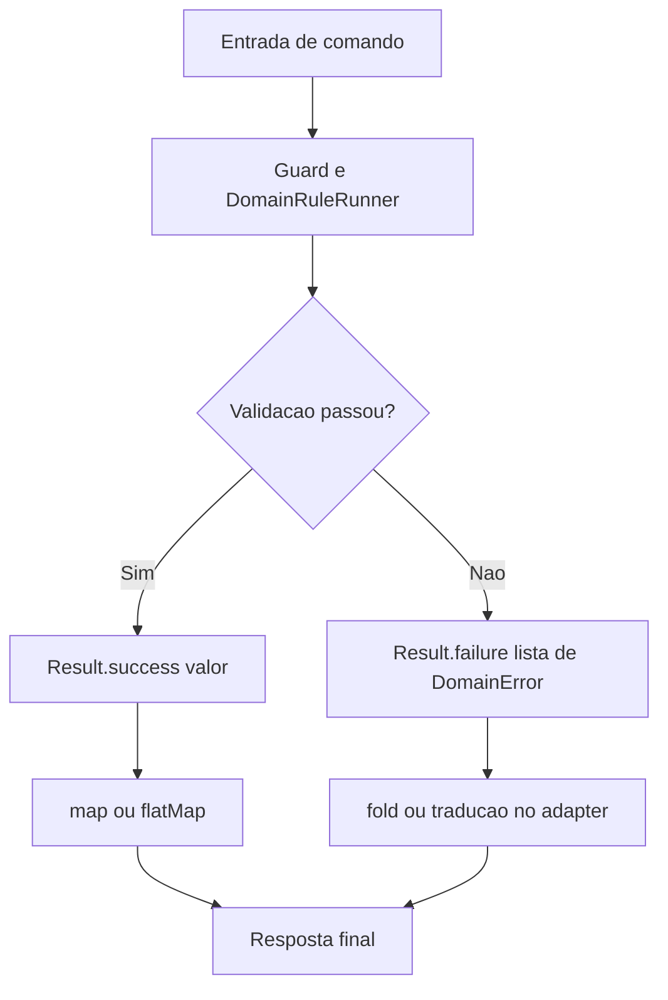
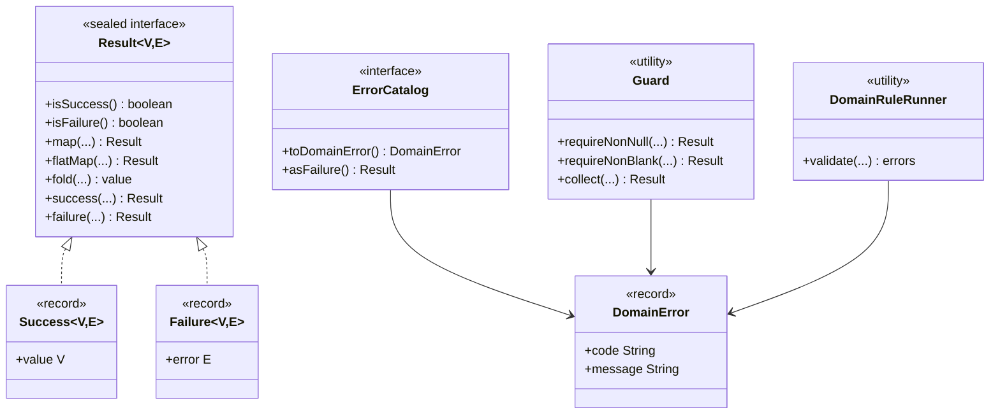
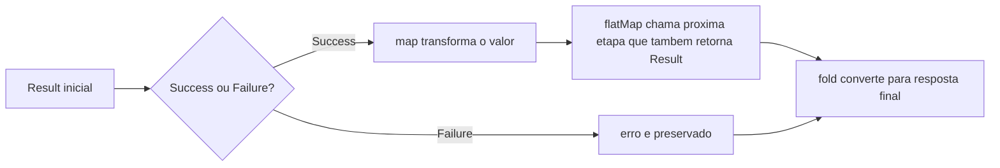
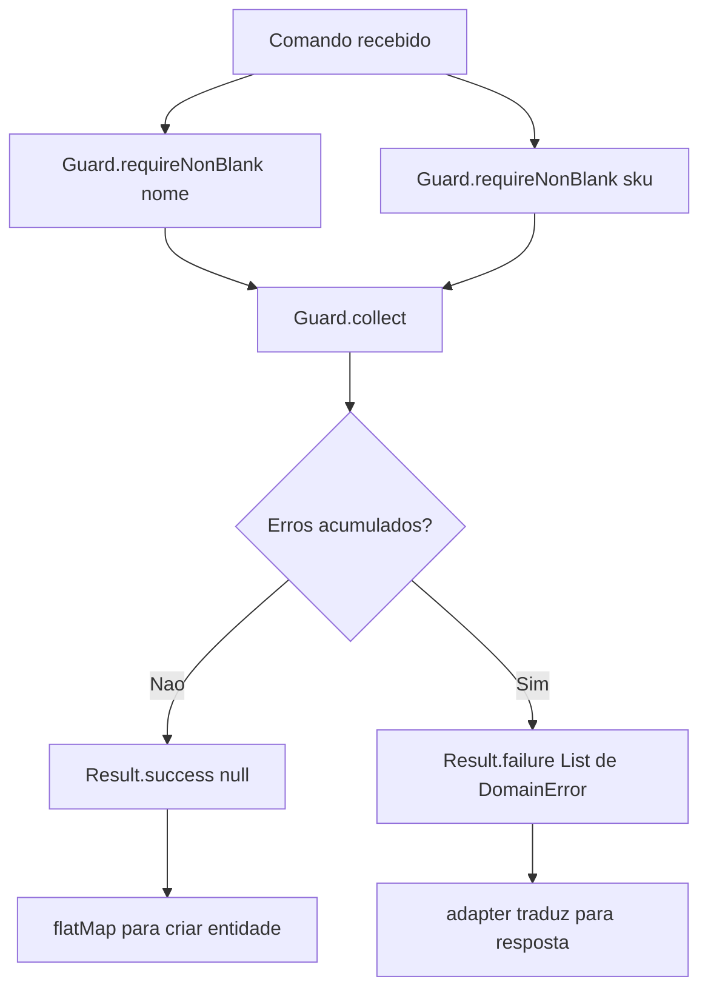
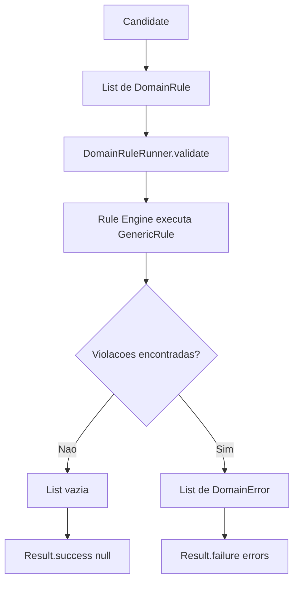
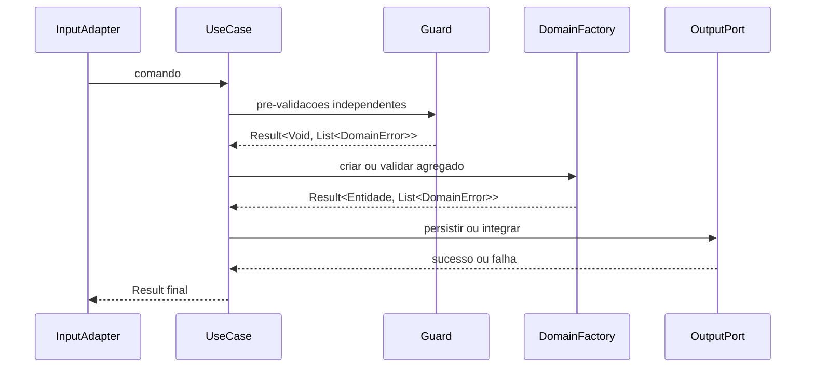

# Result Pattern no modulo shared
Este guia ensina, passo a passo, como usar o fluxo funcional de sucesso/falha sem depender de exception para regra de negocio.
Navegacao: [README central](../README.md) | [Rule Engine](RuleEngine.md) | [Stereotypes](Stereotypes.md)
## 1) Ideia principal
No shared, quase toda validacao funcional segue este contrato:
- `Result.success(valor)` quando a operacao passa
- `Result.failure(erro)` quando a operacao falha
No lugar de `try/catch` para regra de negocio, voce modela o erro como dado (`DomainError`).

## 2) Pecas principais
- `Result<V, E>`: envelope de sucesso (`V`) ou falha (`E`)
- `DomainError`: `record` com `code` e `message`
- `ErrorCatalog`: interface para padronizar erros de um contexto
- `Guard`: utilitario para validacoes simples e acumulacao de erros
- `DomainRule` e `DomainRuleRunner`: validacao declarativa por regras de dominio

## 3) Exemplo minimo (primeiro contato)
```java
import com.acme.shared.pattern.result.DomainError;
import com.acme.shared.pattern.result.Result;
public final class ParseService {
    public Result<Integer, DomainError> parseInt(String raw) {
        if (raw == null || raw.isBlank()) {
            return Result.failure(new DomainError("INPUT_REQUIRED", "Numero e obrigatorio"));
        }
        try {
            return Result.success(Integer.parseInt(raw));
        } catch (NumberFormatException ex) {
            return Result.failure(new DomainError("INVALID_NUMBER", "Valor informado nao e numero"));
        }
    }
}
```
## 4) Operadores mais usados (`map`, `flatMap`, `fold`)
- `map`: transforma o valor de sucesso sem trocar o tipo de erro
- `flatMap`: encadeia uma nova etapa que tambem retorna `Result`
- `fold`: fecha o fluxo convertendo sucesso/falha para um retorno final
```java
Result<String, DomainError> render = parseService.parseInt("21")
        .map(v -> v * 2)
        .map(v -> "Resultado: " + v);
String httpBody = render.fold(
        ok -> "{\"data\":\"" + ok + "\"}",
        err -> "{\"error\":\"" + err.code() + " - " + err.message() + "\"}"
);
```

## 5) Erros padronizados com `ErrorCatalog`
`ErrorCatalog` evita espalhar strings de erro pelo codigo.
```java
import com.acme.shared.pattern.result.DomainError;
import com.acme.shared.pattern.result.ErrorCatalog;
public enum ProductErrors implements ErrorCatalog {
    NAME_REQUIRED,
    SKU_REQUIRED;
    @Override
    public DomainError toDomainError() {
        return switch (this) {
            case NAME_REQUIRED -> new DomainError("PRODUCT_NAME_REQUIRED", "Nome do produto e obrigatorio");
            case SKU_REQUIRED -> new DomainError("PRODUCT_SKU_REQUIRED", "SKU do produto e obrigatorio");
        };
    }
}
```
Uso:
```java
Result<Void, java.util.List<DomainError>> failure = ProductErrors.NAME_REQUIRED.asFailure();
```
## 6) Validacao acumulada com `Guard.collect`
Quando as validacoes sao independentes entre si, acumule tudo e retorne uma lista de erros.

```java
import com.acme.shared.pattern.result.DomainError;
import com.acme.shared.pattern.result.Guard;
import com.acme.shared.pattern.result.Result;
import java.util.List;
Result<Void, List<DomainError>> validation = Guard.collect(List.of(
        Guard.requireNonBlank(command.name(), ProductErrors.NAME_REQUIRED),
        Guard.requireNonBlank(command.sku(), ProductErrors.SKU_REQUIRED)
));
Result<Product, List<DomainError>> created = validation
        .flatMap(ignored -> Result.success(new Product(command.name(), command.sku())));
```
## 7) Validacao declarativa com `DomainRuleRunner`
Para regras de dominio reutilizaveis, use `DomainRule`.

```java
import com.acme.shared.pattern.result.DomainError;
import com.acme.shared.pattern.result.validation.DomainRule;
public final class NameNotBlankRule implements DomainRule<String> {
    @Override
    public boolean isSatisfiedBy(String candidate) {
        return candidate != null && !candidate.isBlank();
    }
    @Override
    public DomainError toDomainError() {
        return new DomainError("NAME_REQUIRED", "Nome nao pode ser vazio");
    }
}
```
Executando regras:
```java
import com.acme.shared.pattern.result.Result;
import com.acme.shared.pattern.result.validation.DomainRuleRunner;
import java.util.List;
List<DomainError> errors = DomainRuleRunner.validate(
        command.name(),
        List.of(new NameNotBlankRule())
);
Result<Void, List<DomainError>> result = errors.isEmpty()
        ? Result.success(null)
        : Result.failure(errors);
```
## 8) Fluxo completo (dominio -> aplicacao -> adapter)
1. Dominio valida e retorna `Result<Entidade, List<DomainError>>`
2. Aplicacao encadeia `flatMap` para chamar portas
3. Adapter traduz falha para HTTP/gRPC/SQS

Esse mesmo estilo aparece fortemente em:
- `modules/domain/orderquestionnaire/src/main/java/com/acme/orderquestionnaire/domain/question/QuestionFactory.java`
- `modules/domain/orderquestionnaire/src/main/java/com/acme/orderquestionnaire/domain/questionnaire/QuestionnaireFactory.java`
- `modules/application/orderquestionnaire/src/main/java/com/acme/orderquestionnaire/application/question/service/CreateQuestionService.java`
## 9) Boas praticas para iniciantes
- Use codigos de erro estaveis (`PRODUCT_NAME_REQUIRED`) para facilitar observabilidade
- Prefira `Guard.collect` na fase de pre-validacao do comando
- Use `flatMap` quando a proxima etapa tambem pode falhar
- Deixe traducao para HTTP apenas no adapter de entrada
- Reserve exception para erro tecnico inesperado
Voltar: [README central do shared](../README.md)
