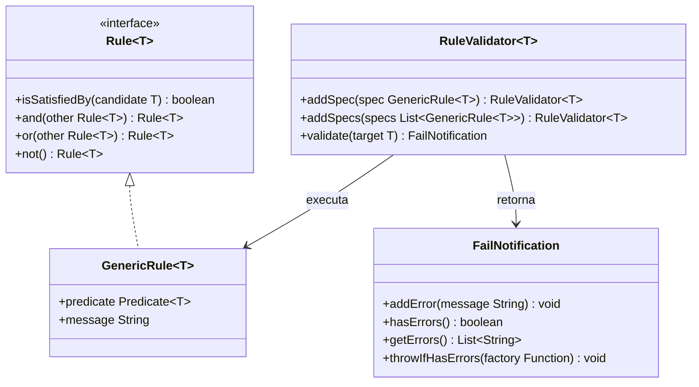

# Rule Engine no modulo shared

Este guia explica como validar objetos com regras pequenas, reutilizaveis e combinaveis.

Navegacao: [README central](../README.md) | [Result Pattern](ResultPattern.md) | [State Machine](StateMachine.md)

## 1) Quando usar

Use o Rule Engine quando voce quer:

- separar regra de validacao da entidade
- combinar regras com `and`, `or`, `not`
- acumular varias mensagens de erro de uma vez

Se voce so precisa validar nulo/vazio rapidamente, `Guard` pode ser suficiente.

## 2) Componentes

- `Rule<T>`: contrato funcional com composicao logica
- `GenericRule<T>`: regra concreta (`Predicate<T>` + `message`)
- `RuleValidator<T>`: executa uma lista de regras
- `FailNotification`: acumulador de mensagens



## 3) Exemplo basico

```java
import com.acme.shared.engine.rule.FailNotification;
import com.acme.shared.engine.rule.GenericRule;
import com.acme.shared.engine.rule.RuleValidator;

record Product(String name, double price, int quantity) {}

GenericRule<Product> nameNotBlank = new GenericRule<>(
        p -> p.name() != null && !p.name().isBlank(),
        "Nome do produto e obrigatorio"
);

GenericRule<Product> pricePositive = new GenericRule<>(
        p -> p.price() > 0,
        "Preco deve ser maior que zero"
);

GenericRule<Product> hasStock = new GenericRule<>(
        p -> p.quantity() > 0,
        "Produto sem estoque"
);

FailNotification notification = new RuleValidator<Product>()
        .addSpec(nameNotBlank)
        .addSpec(pricePositive)
        .addSpec(hasStock)
        .validate(new Product("", -5, 0));

if (notification.hasErrors()) {
    System.out.println(notification.getErrors());
}
```

## 4) Regras compostas com `and`, `or`, `not`

`Rule<T>` possui operadores logicos para cenarios mais sofisticados.

```java
import com.acme.shared.engine.rule.Rule;

Rule<Product> validAndInStock = nameNotBlank.and(pricePositive).and(hasStock);
Rule<Product> invalidNameOrOutOfStock = nameNotBlank.not().or(hasStock.not());

boolean allowed = validAndInStock.isSatisfiedBy(new Product("Notebook", 3000, 4));
```

## 5) Fail-fast opcional com exception

Apesar do shared privilegiar fluxo funcional para negocio, voce pode integrar com excecao quando fizer sentido.

```java
import com.acme.shared.exception.DomainValidationException;

notification.throwIfHasErrors(DomainValidationException::new);
```

## 6) Como isso conversa com o Result Pattern

No dominio `orderquestionnaire`, o projeto usa muito `DomainRuleRunner` para devolver `List<DomainError>`.
Internamente ele aproveita o Rule Engine para executar as regras, e depois mapeia para `DomainError`.

Veja exemplos em:

- `modules/domain/orderquestionnaire/src/main/java/com/acme/orderquestionnaire/domain/question/QuestionFactory.java`
- `modules/domain/orderquestionnaire/src/main/java/com/acme/orderquestionnaire/domain/questionnaire/QuestionnaireFactory.java`

## 7) Boas praticas para iniciantes

- Escreva mensagens de erro claras e orientadas a acao
- Mantenha cada regra pequena e com um unico motivo de mudanca
- Reuse regras em factories diferentes quando o criterio for o mesmo
- Prefira validacoes acumuladas para payload de entrada (melhor UX)
- Use nomes de regra que expressem intencao (`nameNotBlank`, `pricePositive`)

Voltar: [README central do shared](../README.md)

