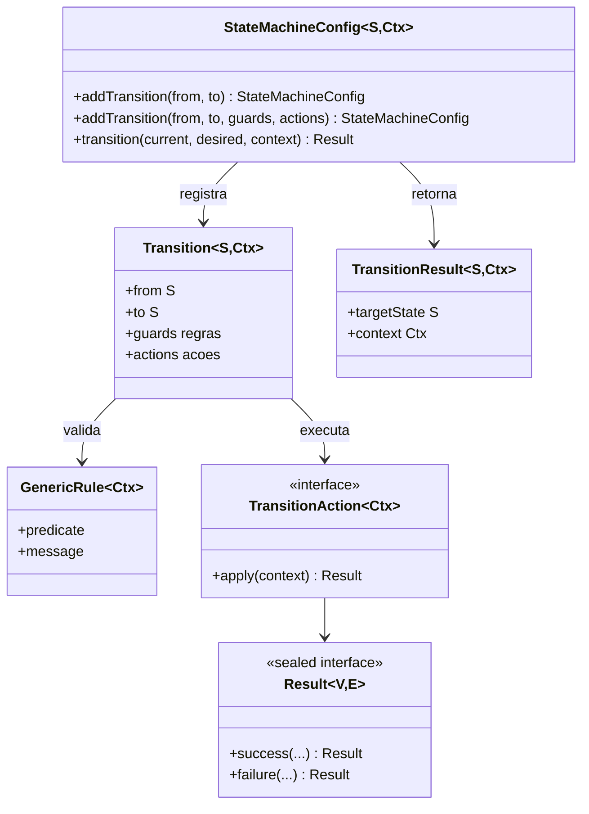
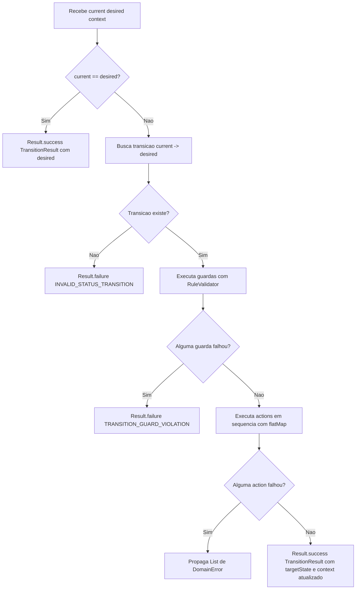
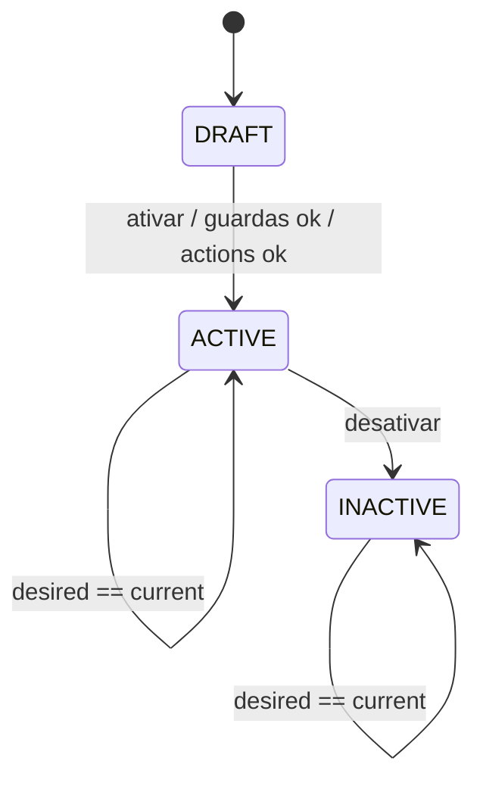
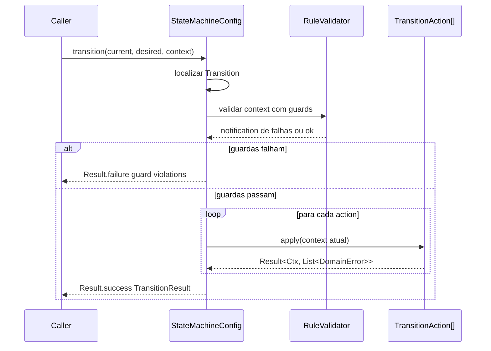

# State machine generica
O shared oferece uma maquina de estados tipada para controlar transicoes de status com regras e acoes.
Navegacao: [README central](../README.md) | [Rule Engine](RuleEngine.md) | [Result Pattern](ResultPattern.md)
## 1) Componentes
- `StateMachineConfig<S, Ctx>`: registra e executa transicoes
- `Transition<S, Ctx>`: define origem, destino, guardas e acoes
- `TransitionAction<Ctx>`: acao funcional que retorna `Result<Ctx, List<DomainError>>`
- `TransitionResult<S, Ctx>`: resultado final com estado alvo e contexto atualizado

## 2) Como funciona
1. Procura transicao `current -> desired`
2. Valida guardas (`GenericRule<Ctx>`)
3. Executa acoes em sequencia com `flatMap`
4. Retorna sucesso com novo estado/contexto ou falha com `DomainError`

## 3) Exemplo completo

```java
import com.acme.shared.engine.rule.GenericRule;
import com.acme.shared.engine.state.StateMachineConfig;
import com.acme.shared.engine.state.TransitionAction;
import com.acme.shared.pattern.result.DomainError;
import com.acme.shared.pattern.result.Result;
import java.util.List;
enum Status { DRAFT, ACTIVE, INACTIVE }
record StatusCtx(boolean hasAtLeastOneQuestion, String updatedBy) {}
GenericRule<StatusCtx> canActivate = new GenericRule<>(
        StatusCtx::hasAtLeastOneQuestion,
        "Questionario precisa de pelo menos uma pergunta para ativar"
);
TransitionAction<StatusCtx> enrichAudit = ctx -> {
    if (ctx.updatedBy() == null || ctx.updatedBy().isBlank()) {
        return Result.failure(List.of(new DomainError("UPDATED_BY_REQUIRED", "updatedBy e obrigatorio")));
    }
    return Result.success(ctx);
};
StateMachineConfig<Status, StatusCtx> machine = new StateMachineConfig<Status, StatusCtx>()
        .addTransition(Status.DRAFT, Status.ACTIVE, List.of(canActivate), List.of(enrichAudit))
        .addTransition(Status.ACTIVE, Status.INACTIVE);
Result<com.acme.shared.engine.state.TransitionResult<Status, StatusCtx>, List<DomainError>> result =
        machine.transition(Status.DRAFT, Status.ACTIVE, new StatusCtx(true, "system"));
```

## 4) Erros padrao da maquina
- `INVALID_STATUS_TRANSITION` quando a transicao nao existe
- `TRANSITION_GUARD_VIOLATION` para falhas de guarda (mensagem vem da regra)
- Erros das `TransitionAction` sao repassados como vieram
## 5) Onde olhar no projeto
Uso real no dominio `orderquestionnaire`:
- `modules/domain/orderquestionnaire/src/main/java/com/acme/orderquestionnaire/domain/questionnaire/QuestionnaireStatusMachine.java`
- `modules/domain/orderquestionnaire/src/main/java/com/acme/orderquestionnaire/domain/question/QuestionStatusMachine.java`
## 6) Boas praticas para iniciantes
- Mantenha guardas puras (sem efeitos colaterais)
- Use `TransitionAction` para passos que podem falhar funcionalmente
- Defina mensagens de guarda pensando em UX
- Evite duplicar regras de transicao em varios lugares
Voltar: [README central do shared](../README.md)
