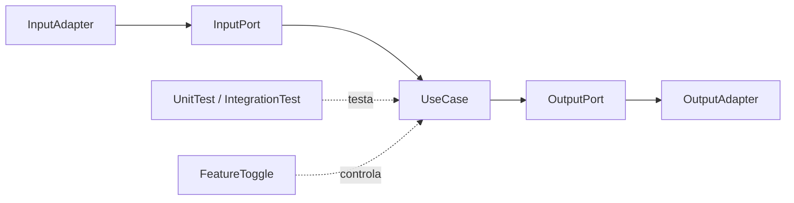
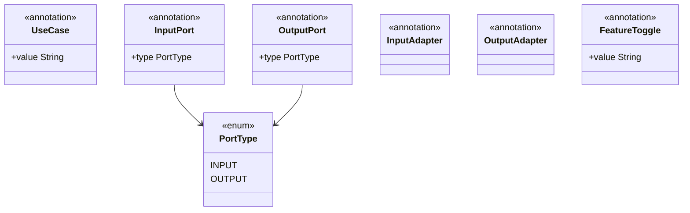

# Stereotypes no modulo shared

Este guia mostra como as anotacoes do modulo `shared` deixam a arquitetura mais explicita e facil de manter.

Navegacao: [README central](../README.md) | [Result Pattern](ResultPattern.md) | [Tenant e Headers](TenantHeaders.md)

## 1) O que sao stereotypes aqui

Neste projeto, stereotypes sao anotacoes que comunicam papel arquitetural.
Elas nao substituem regra de negocio, mas ajudam a deixar as fronteiras claras.



## 2) Anotacoes de arquitetura



### `@UseCase`

Marca classes de aplicacao que orquestram fluxo de negocio.

```java
import com.acme.shared.stereotypes.core.UseCase;

@UseCase("create-question")
public class CreateQuestionService implements CreateQuestionUseCase {
    // orquestracao de comandos, ports e Result
}
```

### `@InputPort`

Marca interfaces que representam portas de entrada (o que o mundo externo pode pedir ao app).

```java
import com.acme.shared.stereotypes.core.InputPort;

@InputPort
public interface CreateQuestionUseCase {
    Result<Void, List<DomainError>> execute(CreateQuestionCommand command);
}
```

### `@OutputPort`

Marca interfaces para dependencias externas que a aplicacao precisa chamar.

```java
import com.acme.shared.stereotypes.core.OutputPort;

@OutputPort
public interface SaveQuestionPort {
    void save(Question question);
}
```

### `@InputAdapter` e `@OutputAdapter`

Marcam implementacoes de adaptadores nas bordas (REST, gRPC, fila, banco, cloud).

```java
import com.acme.shared.stereotypes.adapter.InputAdapter;

@InputAdapter
public class QuestionController {
    // recebe HTTP e chama input port
}
```

```java
import com.acme.shared.stereotypes.adapter.OutputAdapter;

@OutputAdapter
public class MongoQuestionRepositoryAdapter implements SaveQuestionPort {
    // traduz porta para persistencia
}
```

### `@FeatureToggle`

Marca classe ou metodo controlado por flag.

```java
import com.acme.shared.stereotypes.FeatureToggle;

@FeatureToggle("orderquestionnaire.v2")
public class NewFlowService {
    // comportamento ativado condicionalmente
}
```

## 3) Anotacoes de teste

- `@UnitTest` -> adiciona tag `unit`
- `@IntegrationTest` -> adiciona tag `integration`
- `@BddTest` e `@BddTestSteps` -> organizacao semantica para BDD
- `@MockClass` -> marca classes utilitarias de mock

Exemplo:

```java
import com.acme.shared.stereotypes.test.UnitTest;

@UnitTest
class CreateQuestionServiceTest {
    // testes unitarios
}
```

## 4) Onde olhar no projeto

- Use cases anotados:
  - `modules/application/orderquestionnaire/src/main/java/com/acme/orderquestionnaire/application/question/port/in/usecase/CreateQuestionUseCase.java`
  - `modules/application/orderquestionnaire/src/main/java/com/acme/orderquestionnaire/application/questionnaire/port/in/usecase/CreateQuestionnaireUseCase.java`
- Exemplo no modulo security:
  - `modules/security/src/main/java/com/acme/security/application/auditUser/port/in/usecase/RegisterUserUseCase.java`

## 5) Boas praticas para iniciantes

- Sempre anote interfaces de porta (`@InputPort`, `@OutputPort`)
- Sempre anote classes de caso de uso (`@UseCase`)
- Evite colocar logica de negocio em adapter
- Use nomes consistentes: `...UseCase`, `...Port`, `...Adapter`
- Trate stereotypes como contrato de comunicacao da arquitetura

Voltar: [README central do shared](../README.md)

