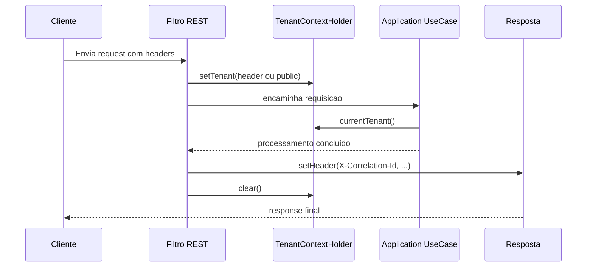
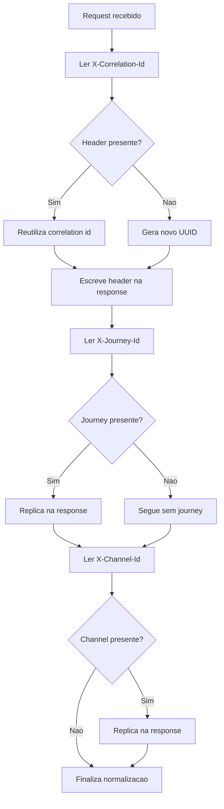

# TenantContextHolder e HeaderConstants

Este guia cobre dois contratos transversais do shared que costumam aparecer na borda da aplicacao.

Navegacao: [README central](../README.md) | [Stereotypes](Stereotypes.md) | [Result Pattern](ResultPattern.md)

## 1) TenantContextHolder

Arquivo: `modules/shared/src/main/java/com/acme/shared/TenantContextHolder.java`

Ele guarda o tenant atual em `ThreadLocal<String>`.

API:

- `setTenant(String tenant)`
- `currentTenant()` (retorna `public` se nada foi definido)
- `clear()`



### Exemplo completo (filtro REST)

```java
import com.acme.shared.TenantContextHolder;
import jakarta.servlet.FilterChain;
import jakarta.servlet.ServletException;
import jakarta.servlet.http.HttpServletRequest;
import jakarta.servlet.http.HttpServletResponse;
import org.springframework.web.filter.OncePerRequestFilter;

import java.io.IOException;

public class TenantFilter extends OncePerRequestFilter {

    private static final String TENANT_HEADER = "X-Tenant-Id";

    @Override
    protected void doFilterInternal(HttpServletRequest request,
                                    HttpServletResponse response,
                                    FilterChain filterChain) throws ServletException, IOException {
        String tenant = request.getHeader(TENANT_HEADER);
        TenantContextHolder.setTenant(tenant == null || tenant.isBlank() ? "public" : tenant);

        try {
            filterChain.doFilter(request, response);
        } finally {
            TenantContextHolder.clear();
        }
    }
}
```

### Cuidados importantes

- Sempre chame `clear()` em bloco `finally`
- Nao use tenant em variavel estatica/global
- Em processamento assincrono, propague contexto explicitamente

## 2) HeaderConstants

Arquivo: `modules/shared/src/main/java/com/acme/shared/constants/HeaderConstants.java`

Constantes disponiveis:

- `CORRELATION_HEADER` -> `X-Correlation-Id`
- `JOURNEY_HEADER` -> `X-Journey-Id`
- `CHANNEL_HEADER` -> `X-Channel-Id`
- `IDEMPOTENCY_HEADER` -> `X-Idempotency-Key`



### Exemplo completo (normalizacao de headers)

```java
import com.acme.shared.constants.HeaderConstants;
import jakarta.servlet.http.HttpServletRequest;
import jakarta.servlet.http.HttpServletResponse;

import java.util.UUID;

public final class HeaderUtil {

    private HeaderUtil() {}

    public static void ensureTracingHeaders(HttpServletRequest req, HttpServletResponse res) {
        String correlation = req.getHeader(HeaderConstants.CORRELATION_HEADER);
        if (correlation == null || correlation.isBlank()) {
            correlation = UUID.randomUUID().toString();
        }

        res.setHeader(HeaderConstants.CORRELATION_HEADER, correlation);

        String journey = req.getHeader(HeaderConstants.JOURNEY_HEADER);
        if (journey != null && !journey.isBlank()) {
            res.setHeader(HeaderConstants.JOURNEY_HEADER, journey);
        }

        String channel = req.getHeader(HeaderConstants.CHANNEL_HEADER);
        if (channel != null && !channel.isBlank()) {
            res.setHeader(HeaderConstants.CHANNEL_HEADER, channel);
        }
    }
}
```

## 3) Onde isso aparece no repositorio

- `modules/adapters/in/api-rest/src/main/java/com/acme/adapters/in/rest/filters/RestHeadersFilter.java` (scaffold/comentado)
- `modules/adapters/in/api-grpc/src/main/java/com/acme/adapters/in/grpc/interceptors/GrpcHeadersInterceptor.java` (scaffold/comentado)
- `modules/adapters/out/mongo/src/main/java/com/acme/adapters/out/mongo/config/MultiTenantMongoDbFactory.java` (referencia comentada)

## 4) Limitacoes atuais

- Os exemplos de filtro/interceptor citados acima existem como scaffold em partes do repositorio.
- Parte do fluxo de propagacao de headers/tenant ainda depende de ativacao completa dos adapters.
- Trate este guia como contrato alvo; confirme sempre o estado do modulo antes de integrar comportamento em producao.

## 5) Boas praticas para iniciantes

- Defina tenant e headers no inicio da requisicao
- Limpe contexto no fim da requisicao
- Reuse constantes do shared em vez de strings soltas
- Padronize resposta de erro quando headers obrigatorios faltarem

Voltar: [README central do shared](../README.md)

