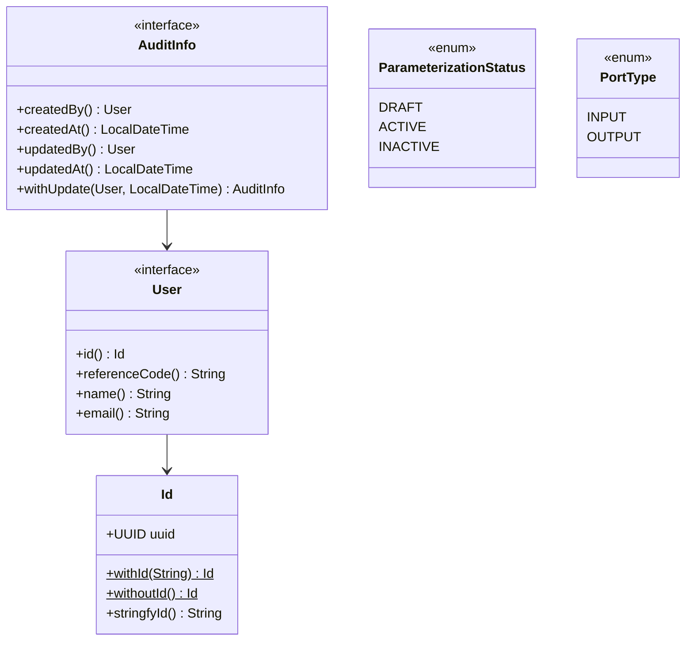
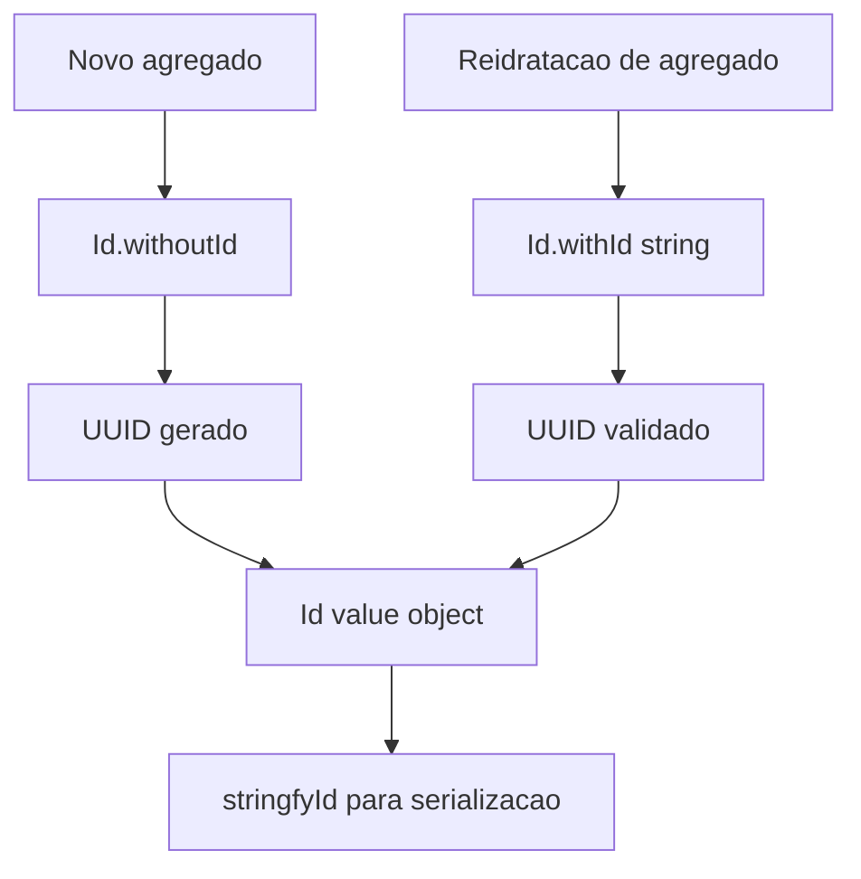
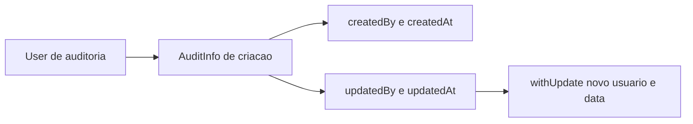
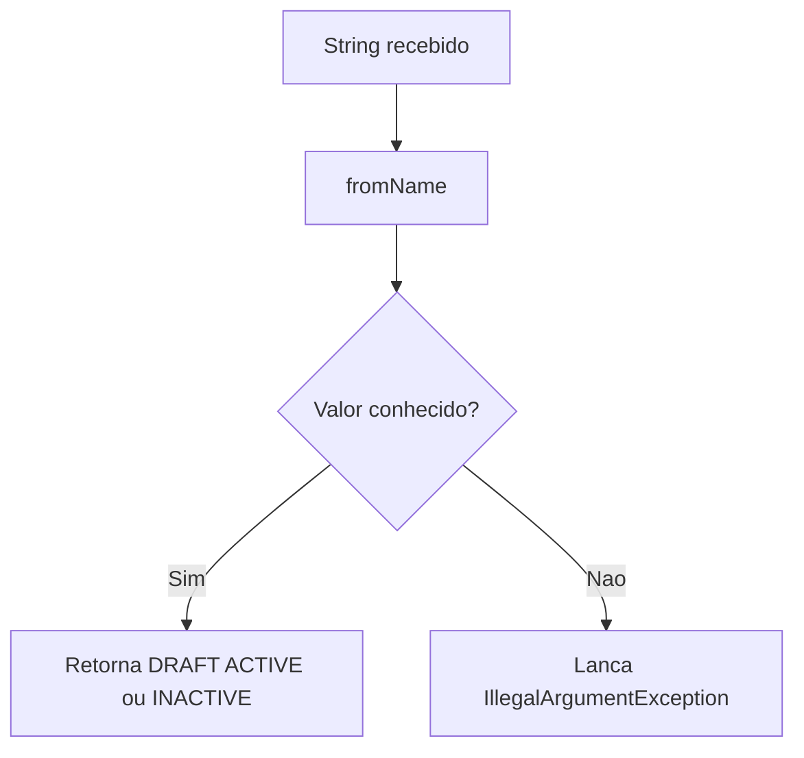

# Value objects e enums do shared

Este guia detalha tipos pequenos, mas essenciais, que aparecem em varios modulos.

Navegacao: [README central](../README.md) | [Stereotypes](Stereotypes.md) | [Pagination](Pagination.md)



## 1) `Id`

Arquivo: `modules/shared/src/main/java/com/acme/shared/vo/Id.java`

`Id` encapsula `UUID` em um `record`.



- `Id.withoutId()` gera novo UUID
- `Id.withId(String)` reidrata UUID existente
- `stringfyId()` retorna string

Exemplo:

```java
import com.acme.shared.vo.Id;

Id generated = Id.withoutId();
Id rehydrated = Id.withId("23773b26-3297-4fd9-ac1b-f5b287005f1b");

String raw = generated.stringfyId();
```

## 2) `User` e `AuditInfo`

Arquivos:

- `modules/shared/src/main/java/com/acme/shared/vo/User.java`
- `modules/shared/src/main/java/com/acme/shared/vo/AuditInfo.java`

Sao interfaces de contrato para auditoria de dominio.

`User` define identidade minima do usuario de negocio:

- `id()`
- `referenceCode()`
- `name()`
- `email()`

`AuditInfo` define criacao/atualizacao:

- `createdBy()`, `createdAt()`
- `updatedBy()`, `updatedAt()`
- `withUpdate(User, LocalDateTime)`



Observacao importante:

- `com.acme.shared.vo.AuditUser` e um contrato de auditoria usado por modulos de dominio.
- Ele nao substitui entidades especificas como `com.acme.security.domain.auditUser.User`.
- Em resumo: o `User` do shared descreve o minimo necessario para auditoria; cada modulo pode ter seu proprio agregado de usuario.

## 3) `ParameterizationStatus`

Arquivo: `modules/shared/src/main/java/com/acme/shared/enumerator/ParameterizationStatus.java`

Valores:

- `DRAFT`
- `ACTIVE`
- `INACTIVE`

Possui parser tolerante a case via `fromName(String)`.



```java
import com.acme.shared.enumerator.ParameterizationStatus;

ParameterizationStatus status = ParameterizationStatus.fromName("active");
```

Se valor for invalido, lanca `IllegalArgumentException`.

## 4) `PortType`

Arquivo: `modules/shared/src/main/java/com/acme/shared/enumerator/PortType.java`

Enum simples usado em estereotipos de porta:

- `INPUT`
- `OUTPUT`

Exemplo:

```java
@InputPort(type = PortType.INPUT)
public interface MyInPort {}
```

## 5) `DomainValidationException`

Arquivo: `modules/shared/src/main/java/com/acme/shared/exception/DomainValidationException.java`

Exception utilitaria para cenarios em que voce quer fail-fast com lista de erros:

```java
notification.throwIfHasErrors(DomainValidationException::new);
```

## 6) Boas praticas para iniciantes

- Nao exponha `UUID` cru por toda parte: prefira `Id`
- Use contratos de `User` e `AuditInfo` para manter dominio desacoplado
- Centralize parse de status em `ParameterizationStatus.fromName`
- Para regras de negocio, prefira `Result`; use exception apenas quando apropriado

Voltar: [README central do shared](../README.md)


